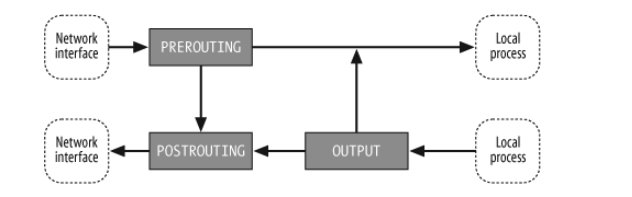
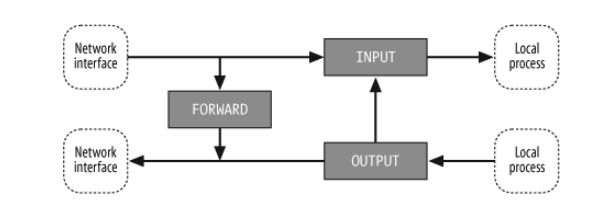
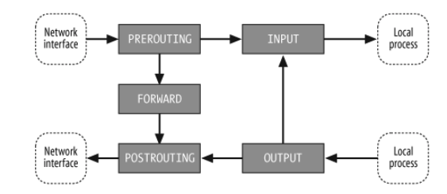

# Notes from Linux iptables Pocket Reference

## Introduction
- The Linux kernel’s network packet processing subsystem is called **Netfilter**, and **iptables** is the command used to configure it.
- iptables groups network packet processing **rules** into **tables** by function (i.e. filter, nat, mangle). Each table has **chains** of processing rules.
- **Rules** consist of matches used to determine which packets the rulle will apply to and **targets**. The **target** determines what will be done with the matching packets.
- iptables operates at OSI Layer 3 (Network)

## Concepts
- iptables defines five "hook points" in the kernel's packet processing pathways. Built-in chains are attached to these hook points.
- You can add a sequence of rules for each hook point
- Each **rule** represents an opportunity to affect or monitor packet flow
- **Chains** represent hook points in the packet flow
- **Tables** represent the types of processing that can occur
- The default table is the `filter` table; if you do not specify an explicit table in an iptables command, filter is assumed
- iptables comes with three built-in tables: `filter`, `mangle`, and `nat`

**nat table**



**filter table**



**mangle table**




Hook | Allows you to process packets ..
--- | ---
FORWARD | ... that flow through a gateway computer, coming in one interface and going right back out another
INPUT | ... just before they are delivered to a local process
OUTPUT | ... just after they are generated by a local process
POSTROUTING | ... just before they leave a network interface
PREROUTING | ... just as they arrive from a network interface (after dropping any packets resulting from the interface being in promiscuous mode and after checksum validation)

## Chains and Packet Flow
- Packets traverse chains and presented to the chain's rules one at a time in order.
- A chain's **policy** determines the fate of packets that reach the end of the chain without otherwise being sent to a specific target
- Only built-in targets `ACCEPT` and `DROP` can be used as the policy for a built-in chain.
- You can creat custom chains to organize rules
- All user-defined chains have a implicit policy of `RETURN` that cannot be changed

## Rules
- A **rule** consists of one or more match criteria that determine which network packets it affects and a target specification that determines how the network packets will be affected
- The system maintains packet and byte counters for every rule
- both the match and target portion of the rule are optional. If there are no match criteria, all packets match. If there is no target specification, nothing is done to the packets.
- Use the `-m` or `--match` option to use extensions for specialized matches
- **Targets** are used to specify the action to take when a rule matches a packet

Target | Description
--- | ---
`ACCEPT` | Let the packet through to the next stage of processing. Stop traversing the current chain and start at the next stage.
`DROP` | Discontinue processing the packet completely. Do not check it against any other rules, chains, or tables.
`REJECT` | Similar to `DROP` but sends feedback to the sender
`QUEUE` | Send the packet to userspace
`RETURN` | From a rule in a user-defined chain, discontinue processing this chain, and resume traversing the calling chain at the rule following the one that had this chain as its target. From a rule in a built-in chain, discontinue processing the packet and apply the chain's policy to it.

## Applications
### Packet filtering
Packet filtering involves examining packets at various points as they move through the kernel’s networking code and making decisions about how the packets should be handled (accepted into the next stage of processing, dropped completely without a reply, rejected with a reply, and so on).

### Accounting
Accounting involves using byte and/or packet counters associated with packet matching criteria to monitor network traffic volumes.

### Connection tracking
Connection tracking provides additional information that can match related packets in ways that are otherwise impossible.

### Packet mangling
Packet mangling involves making changes to packet header fields (such as network addresses and port numbers) or payloads.

### Network address translation (NAT)
- Network address translation is a type of packet mangling that involves overwriting the source and/or destination addresses and/or port numbers.
- The term “Source NAT” (or just S-NAT or SNAT) refers to NAT involving changes to the source address and/or port, and “Destination NAT” (or just D-NAT or DNAT) refers to NAT involving changes to the destination address and/or port.

### Masquerading
- Masquerading is a special type of SNAT in which one computer rewrites packets to make them appear to come from itself. 
- The computer’s IP address used is determined automatically, and if it changes, old connections are destroyed appropriately. Masquerading is commonly used to share an Internet connection with a dynamic IP address among a network of computers.

### Port Forwarding
- Port forwarding is a type of DNAT in which one computer (such as a firewall) acts as a proxy for one or more other computers. 
- The firewall accepts packets addressed to itself from the outside network, but rewrites them to appear to be addressed to other computers on the inside network before sending them on to their new destinations.
- Related reply packets from the inside computers are rewritten to appear to be from the firewall and sent back to the appropriate outside computer.
- To the outside world, it appears that the services are being provided by the proxy machine, and to the actual server, it appears that all requests are coming from the proxy machine.

### Load balancing
- Load balancing involves distributing connections across a group of servers so that higher total throughput can be achieved. One way to implement simple load balancing is to set up port forwarding so that the destination address is selected in a round-robin fashion from a list of possible destinations.

## Frequently used arguments
```sh
-t # Table (filter, nat, or mangle)

-s # Source address range
-d # Desintation address range

-i # Input interface in (if in ends with +, any interface having a name that starts with in will match).
-o # Input interface out (if out ends with +, any interface having a name that starts with out will match).

-p # protocol name (i.e. tcp, udp, icmp)
--dport # Match when the TCP destination port number is equal to port

-m # Invoke extended match

-I # Inserts rule into chain
-A # Appends rule to chain
-D # Delete rule from chain
-R # Replaces the rule at position index of chain with the new rule. (chain index rule)

-P # Sets the default policy of the built-in chain to target. Applies to built-in chains and targets only.
-N # Creates a new user-defined chain.

--to-source # Change the source IP address field of the packet to the addresses given

-v # Verbose mode
-L # List the rules in a chain or all chains
-S # Print the rules in a chain or all chains
-c # Packet and byte counter
--line-numbers # When combined with the -L subcommand, displays numbers for the rules in each chain, so you can refer to the rules by index when inserting rules into (via -I) or deleting rules from (via -D) a chain.
```

**Reviewing rules**
```sh
# List chains and their rx/tx count
iptables -L -v

# List rules by chain
sudo iptables -S

# dmsg for kernel logs 
# TODO read this: https://www.opsist.com/blog/2015/08/11/how-do-i-see-what-iptables-is-doing.html

```

## Resources
- Linux iptables Pocket Reference by Gregor N. Purdy Published by O'Reilly Media, Inc., 2004
- https://www.opsist.com/blog/2015/08/11/how-do-i-see-what-iptables-is-doing.html
